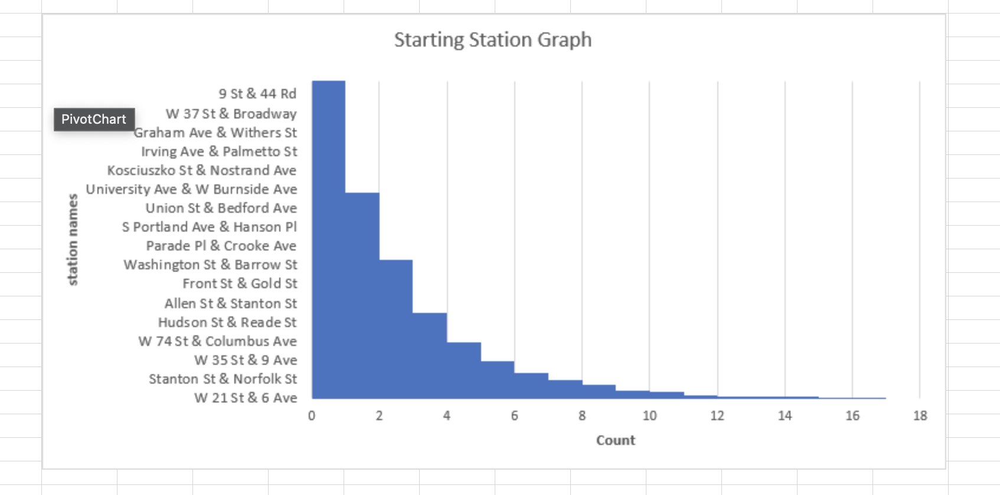
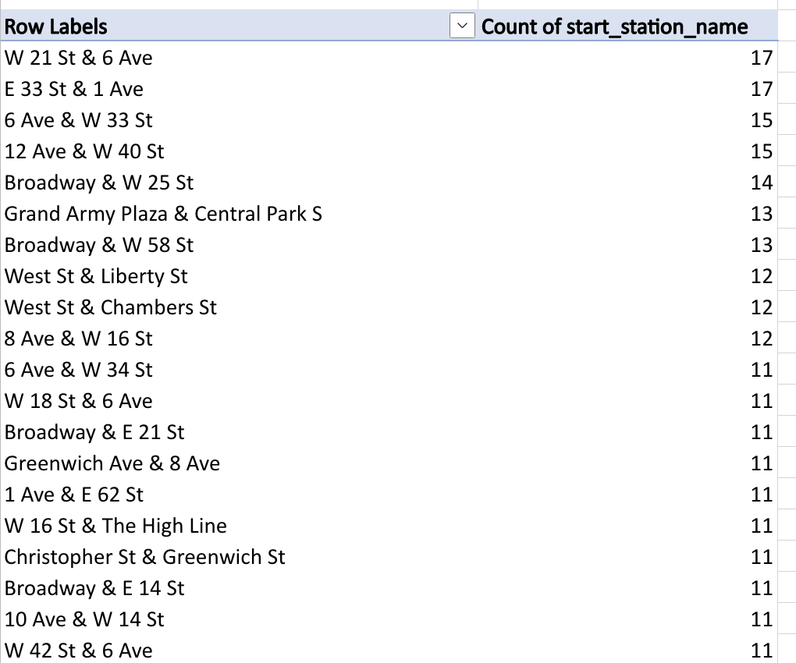
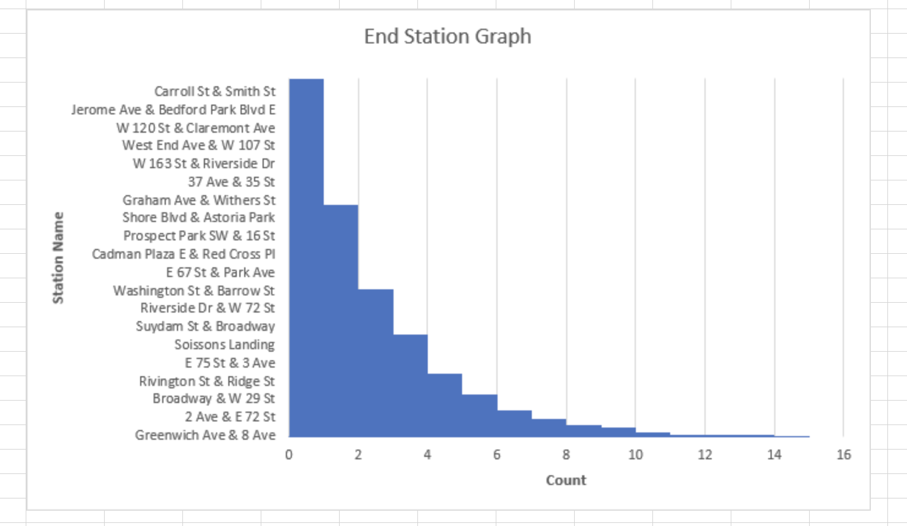
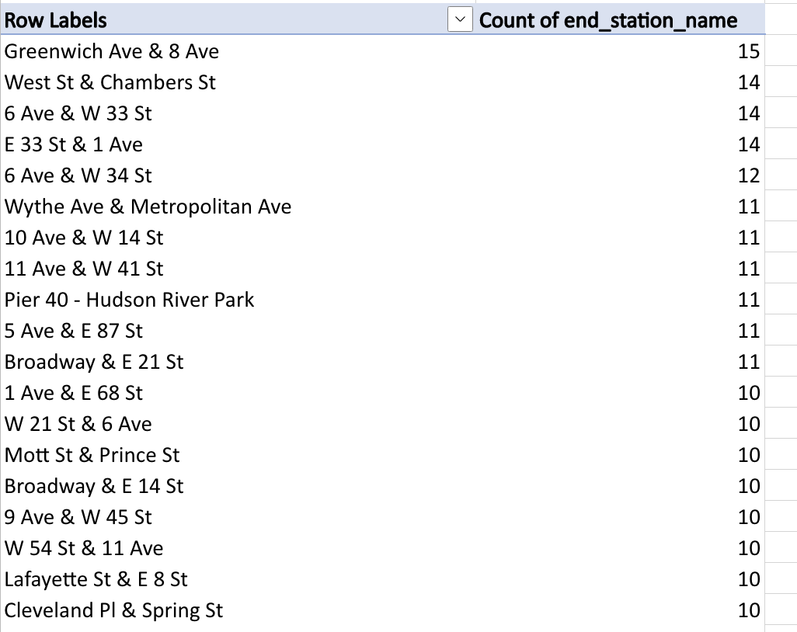

# Spreadsheet Analysis  

Link to Data files in google [drive](https://drive.google.com/drive/folders/1_XpAvWSoyURmsjZGca_4CB14hVh7Tz8z?usp=share_link)  
  
  
In this assignment, I have chosen NYC's Citibike Dataset from July 2022. While browsing through [Data Sources by Topic](http://guides.nyu.edu/content.php?pid=352851&sid=2886542) (especially NYC data sources), I was able to find my specific dataset [here] (https://s3.amazonaws.com/tripdata/index.html).  
  
Luckily, I was able to receive my dataset through a CSV file and I have displayed the first 20 rows of the raw dataset below. Further descriptions will be listed below the data.

|    | ride_id          | rideable_type   | started_at          | ended_at            | start_station_name         |   start_station_id | end_station_name              |   end_station_id |   start_lat |   start_lng |   end_lat |   end_lng | member_casual   |
|---:|:-----------------|:----------------|:--------------------|:--------------------|:---------------------------|-------------------:|:------------------------------|-----------------:|------------:|------------:|----------:|----------:|:----------------|
|  0 | C09E4093905089BD | classic_bike    | 2022-07-23 11:34:57 | 2022-07-23 11:45:08 | Melrose St & Broadway      |            4801.04 | Myrtle Ave & Grove St         |          4816.05 |     40.6975 |    -73.9359 |   40.699  |  -73.9152 | member          |
|  1 | 374630DB5822C392 | electric_bike   | 2022-07-29 18:19:08 | 2022-07-29 18:26:50 | E 68 St & 3 Ave            |            6896.16 | E 85 St & York Ave            |          7146.04 |     40.7671 |    -73.9622 |   40.7754 |  -73.948  | member          |
|  2 | 4F73CA25880A1215 | electric_bike   | 2022-07-16 16:30:58 | 2022-07-16 17:39:18 | W 37 St & 10 Ave           |            6611.02 | Knickerbocker Ave & Cooper St |          4582.05 |     40.7566 |    -73.9979 |   40.6908 |  -73.9045 | member          |
|  3 | ECD6EE19C0CC1D31 | electric_bike   | 2022-07-17 17:35:57 | 2022-07-17 18:03:36 | W 37 St & 10 Ave           |            6611.02 | 6 Ave & Broome St             |          5610.09 |     40.7566 |    -73.9979 |   40.7243 |  -74.0047 | member          |
|  4 | 44D0987673B9997D | classic_bike    | 2022-07-11 07:56:29 | 2022-07-11 07:59:15 | E 68 St & 3 Ave            |            6896.16 | E 66 St & Madison Ave         |          6969.08 |     40.7671 |    -73.9622 |   40.768  |  -73.9685 | member          |
|  5 | A80F03B56110AFF8 | classic_bike    | 2022-07-14 19:35:53 | 2022-07-14 19:50:06 | Clinton Ave & Flushing Ave |            4762.04 | Bergen St & 4 Ave             |          4322.06 |     40.6979 |    -73.9699 |   40.6826 |  -73.9799 | member          |
|  6 | D967C4FDF71ADE61 | classic_bike    | 2022-07-26 20:18:17 | 2022-07-26 20:26:57 | E 68 St & 3 Ave            |            6896.16 | E 85 St & York Ave            |          7146.04 |     40.7671 |    -73.9622 |   40.7754 |  -73.948  | member          |
|  7 | 62DA916392DE2A17 | electric_bike   | 2022-07-13 06:46:50 | 2022-07-13 06:50:26 | E 89 St & York Ave         |            7204.08 | E 85 St & York Ave            |          7146.04 |     40.7779 |    -73.946  |   40.7754 |  -73.948  | member          |
|  8 | DBFDF326FBAC1C0B | classic_bike    | 2022-07-02 11:54:21 | 2022-07-02 11:57:11 | E 89 St & York Ave         |            7204.08 | E 85 St & York Ave            |          7146.04 |     40.7779 |    -73.946  |   40.7754 |  -73.948  | member          |
|  9 | 5BB3497D14360353 | electric_bike   | 2022-07-31 15:30:06 | 2022-07-31 15:34:57 | 35 Ave & 37 St             |            6563.12 | 38 St & 30 Ave                |          6850.01 |     40.7557 |    -73.9237 |   40.7642 |  -73.9158 | member          |
| 10 | FDE9C93E92EEA453 | classic_bike    | 2022-07-02 23:50:09 | 2022-07-03 00:01:16 | Stockholm St & Wilson Ave  |            4824.03 | Knickerbocker Ave & Cooper St |          4582.05 |     40.6993 |    -73.923  |   40.6908 |  -73.9045 | casual          |
| 11 | 12A91593D98FF664 | classic_bike    | 2022-07-18 20:24:26 | 2022-07-18 20:27:52 | E 58 St & Madison Ave      |            6839.04 | E 66 St & Madison Ave         |          6969.08 |     40.763  |    -73.9721 |   40.768  |  -73.9685 | member          |
| 12 | 7DE97AA765E2DACB | electric_bike   | 2022-07-23 12:28:28 | 2022-07-23 12:34:41 | W 55 St & 6 Ave            |            6809.09 | E 66 St & Madison Ave         |          6969.08 |     40.7632 |    -73.9784 |   40.768  |  -73.9685 | member          |
| 13 | A178013F1F884220 | classic_bike    | 2022-07-07 15:05:14 | 2022-07-07 15:11:57 | 35 St & Broadway           |            6750.16 | 38 St & 30 Ave                |          6850.01 |     40.7603 |    -73.9222 |   40.7642 |  -73.9158 | member          |
| 14 | 0D2CDEECA15D682E | classic_bike    | 2022-07-18 13:42:01 | 2022-07-18 14:05:00 | 35 St & Broadway           |            6750.16 | 38 St & 30 Ave                |          6850.01 |     40.7603 |    -73.9222 |   40.7642 |  -73.9158 | member          |
| 15 | 7D8E808278B86CBC | electric_bike   | 2022-07-08 18:43:09 | 2022-07-08 19:07:43 | 35 St & Broadway           |            6750.16 | Engert Ave & McGuinness Blvd  |          5473.03 |     40.7603 |    -73.9222 |   40.7216 |  -73.9455 | member          |
| 16 | 0B4168237A91DCFA | classic_bike    | 2022-07-15 10:49:49 | 2022-07-15 10:55:03 | Perry St & Bleecker St     |            5922.07 | 6 Ave & Broome St             |          5610.09 |     40.7354 |    -74.0042 |   40.7243 |  -74.0047 | member          |
| 17 | 6B349D1231B989CB | electric_bike   | 2022-07-04 11:30:41 | 2022-07-04 11:45:24 | Steinway St & 19 Ave       |            7220.01 | 38 St & 30 Ave                |          6850.01 |     40.7781 |    -73.8996 |   40.7642 |  -73.9158 | casual          |
| 18 | AD88BE68B3F32F56 | classic_bike    | 2022-07-30 11:46:26 | 2022-07-30 11:54:50 | Perry St & Bleecker St     |            5922.07 | 6 Ave & Broome St             |          5610.09 |     40.7354 |    -74.0048 |   40.7243 |  -74.0047 | member          |
| 19 | FD1511B74F10F9BF | classic_bike    | 2022-07-19 15:06:13 | 2022-07-19 15:36:32 | Dock 72 Way & Market St    |            4804.02 | 6 Ave & Broome St             |          5610.09 |     40.6998 |    -73.9714 |   40.7243 |  -74.0047 | member          |  
  
## Problems  
My biggest issue was the fact that this datset contained more than 3 million entries. This caused my computer to run and debug slow and I had to come up with a solution to gain a better understanding of this data. I decided that with a dataset this large, I wanted to take a sample and analyze that sample instead. Therefore, I sliced every 1200th row in order to get a sample that was easier to work with, around 2900 entries. I then looked at the columns and decided which were unecessary towards my analysis and decided to munge them out. I removed ride_id because it was going to be insignficant towards my findings. I also removed columns that included start_station_id and end_station_id because I already had columns that gave me the station names. I then proceeded to remove longitude/latitude columns because I was not going to use those towards my prognosis.  
  
## Munging  
After I removed all the unecessary data I did not want to work with I further scrubbed this dataset with converting the start/stop times of the citibikes to datetimes for Pandas to recognize. As you can follow the notes on my code as well, I then sorted the column of dates through ascending order so that July 1, 2022 entries would be at the top and July 31, 2022 entries would be at the bottom. Because the start/end columns included both date and time I decided to isolate the time from the date in order to get the trip duration as denoted in the column called >difference. I wanted this column to all be in one unit, so I chose to go with the smallest unit that made sense for my data and I converted it all into seconds. I also removed trip durations that were less than 60 seconds and over 24 hours because they were due to faulty error of a bike not working and having to redock or a rider forgetting about a bike and leaving it overnight. The remainder of my code I did a couple tests for my own sake to find the which type of bike was more common or which station was the most common so I could then compare with my findings through Excel. This munged data was then transferred into a new CSV file called clean_data.  
  
## Things to Note    
Some things I would like to point out is that my findings are not based on all the entries for the month of July 2022 for NYC Citibike Data. I was able to slice this dataset into something more usable for the purpose of this assignment and any value of slicing can be changed or replaced if needed. Any replication of this data with a different sample size would most likely yield different results but my methods are the same and they can be used with any sample size.  
  
## Results  
Some pre-excel findings show:  
- Classic bikes were used more often than Electric Bikes.   
- Most common station to start at was E 33 St & 1 Ave.  
- Most common station to end at was Greenwich Ave & 8 Ave.  
- Given a rider, it was more likely for the rider to be a member of Citibike than a casual rider.  
  
**EXCEL FINDINGS:**  
- Classic bikes were indeed used more often than Electric Bikes.  
- Most common station to start at was actually W 21 St & 6 Ave, AND E 33 St & 1 Ave.  
- Most common station to end at was Greenwich Ave & 8 Ave, matching pre-Excel findings.  
- Given a rider, it was more likely for the rider to be a member of Citibike than a casual rider, matching pre-Excel findings.  

## Calculations  
- Based on this sample size of 2823 entries, the average time of riding was 991.5894439 seconds. I which then converted this to a more readable format and concluded that the average riding time between the users of this sample was 16 minutes and 31 seconds.  
- In total, riders of this sample size rode for 2799257 seconds, equating to 777 hours, 34 minutes, & 17 seconds.  
- After removing the outliers, the minimum riding time was 63 seconds and the maximum riding time was 7 hours, 46 minutes & 35 seconds.  
**These findings can also be seen on Excel as well.**  
  
## Visuals  
  

  
As you can see, this chart visually represents the most common station being at 21 St. With the chart we can further see that E 33 St & 1 Ave also had the same frequency, which was not caught in previous tests.  

  
  
  
As you can see with this end station chart and graph, it matches with previous tests and further confirms that the most common station to end at was Greenwich Ave & 8 Ave.  

## Overall  
After my analysis on this dataset, I was quite surprised at how many people citibiked. I can see why biking has been an important integration among NYC roads. For there to be 3 million entries for only one month out of the year, granted July is a warm and more desirable month to Citibike but the number of entries truly shocked me. Diving further, the smaller sample that I munged out, the maximum time of riding was over 7 hours! That was crazy to me. This assignment did take me quite longer than I had wanted, however I am glad it is done now.  

#### Extra Credit  
As noted in the instructions, I would like to request extra credit because of how large of a dataset I initally had to work with. The dataset enabled me to think of creative ways of munging and analyzing as shown by my code in order to come up with the best sample I used for this assignment. This assignment took so long, I kindly ask for extra credit. Thank you.
